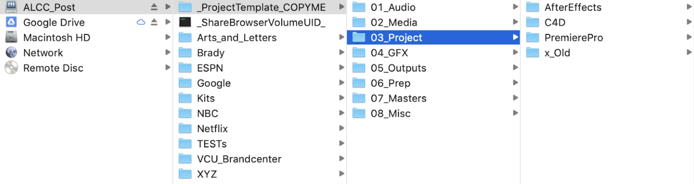

<!-- Title slide. -->

   
  <h3>XYZ Roadmap: Best Practices</h3>
►

------

## Hey, welcome to XYZ

<!-- .slide: background-color="media/img/aframe.jpg" -->

*Don’t worry, you still work at A&L.  
XYZ is the department that handles all editorial and animation needs.

  

►

------

### Well what has A&L and XYZ made, you ask?  

▼

---
Remote
<iframe data-src="https://drive.google.com/file/d/1JJC4MYa8IE7WrcLGnFnTpOFmz5AtEeAf/preview" data-preload width="1080" height="560"></iframe>
  
▼
---

▲

  
Wave 3

<iframe data-src="https://drive.google.com/file/d/1JCdbIJ-PDI1fXRFTwyrPHX_H26X3W5Xg/preview" data-preload width="1080" height="560"></iframe>

▼

---

▲

Wave 3

<iframe data-src="https://drive.google.com/file/d/1JDzY7a5hD9vyVtGDIef-zKPwdhgsXylm/preview" data-preload width="960" height="560"></iframe>

▼

---

▲

Home Alone

<iframe data-src="https://drive.google.com/file/d/1JKkDZMl275z5hWKFQDmRr8x-kzaq-hdh/preview" width="960" height="560"></iframe>

▼

---

▲

Home Alone with Joe Pesci

<iframe data-src="https://drive.google.com/file/d/1JJLqPiCkX3w0VPRVsFQHuWht94p1qIjx/preview" data-preload width="960" height="560"></iframe>

▼

------
### Now let’s make some more stuff.   

►

------
### Already know what you need?

(familiar faces can skip the line using the links below)

   

<ul class="item-list" style="list-style-type:none">
<a href="#/5"><li class="list-text">  Software Versions      </li> </a>
<a href="#/7"><li class="list-text">  Folder Structure | Overview     </li> </a>
<a href="#/5"><li class="list-text">  First Steps in Premiere     </li> </a>
<a href="#/5"><li class="list-text">  Premiere Exports and File Sharing     </li> </a>
</ul>

<ul class="item-list" style="list-style-type:none">
<a href="#/5" margin><li class="list-text">  After Effects Exports and File Sharing
     </li> </a>
<a class="link-list" href="#/5"><li class="list-text">  Acquiring Media Assets     </li> </a>
<a href="#/5"><li class="list-text">  Tips, Tricks, and Tutorials     </li> </a>
<a href="#/5"><li class="list-text">  Contract End / Final Steps     </li> </a>
</ul>

►

------
### We're a team. 
And when we update,

 we update as a team.

We’re currently working in
<b>Version 13.1.2 of Premiere and Version 16.1.1 of After Effects. </b>  
All of these are under the Creative Cloud 2019 Builds. 

For a seamless experience/file quality continuity/overall good time please do not update to a newer version without getting the official go-ahead from the XYZ producer.

------
### So XYZ operates using this “thing” called 
the server…
 

------
### Server Structure & Overview

▼

---
### Starting a New Project
Projects and media can be accessed by any machine connected to the server.

To keep things consistent, we all use/copy a template project folder, which has sub-folders where all of your projects, assets, media, exports, etc. will live.

When starting a new project, simply copy the entire 2019_AL_Project Structure folder (with all sub-folders) and paste into the relevant folder for your client/project. The Folder structure is on the ALCC server (see image)

In “03_Project” there are both AfterEffects and PremierePro folders which have template projects (BLANK_PROJECT) that you can rename to start your project edit or animation.  

▼

