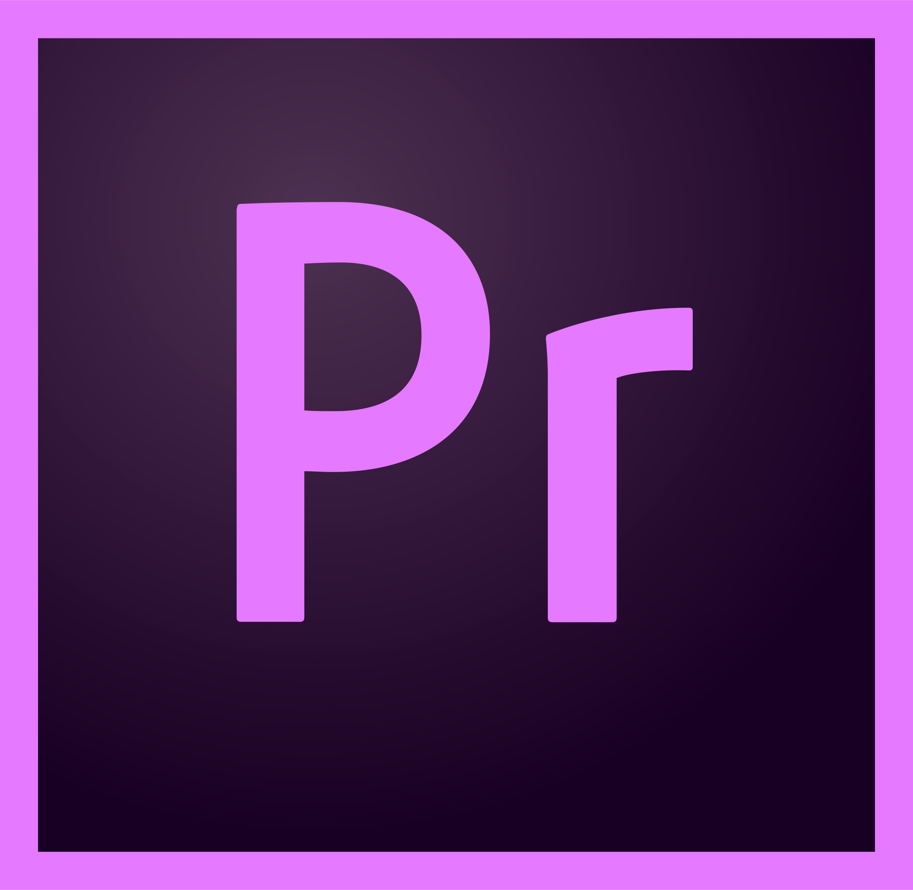

<!-- Title slide. -->

   
  <h3>XYZ Roadmap: Best Practices</h3>
►

------

## Hey, welcome to XYZ

<!-- .slide: background-color="media/img/aframe.jpg" -->

*Don’t worry, you still work at A&L.  
XYZ is the department that handles all editorial and animation needs.

  

►

------

### Well what has A&L and XYZ made, you ask?  

▼

---
Remote
<iframe data-src="https://drive.google.com/file/d/1JJC4MYa8IE7WrcLGnFnTpOFmz5AtEeAf/preview" data-preload width="1080" height="560"></iframe>
  
▼
---

▲

  
Wave 3

<iframe data-src="https://drive.google.com/file/d/1JCdbIJ-PDI1fXRFTwyrPHX_H26X3W5Xg/preview" data-preload width="1080" height="560"></iframe>

▼

---

▲

Wave 3

<iframe data-src="https://drive.google.com/file/d/1JDzY7a5hD9vyVtGDIef-zKPwdhgsXylm/preview" data-preload width="960" height="560"></iframe>

▼

---

▲

Home Alone

<iframe data-src="https://drive.google.com/file/d/1JKkDZMl275z5hWKFQDmRr8x-kzaq-hdh/preview" width="960" height="560"></iframe>

▼

---

▲

Home Alone with Joe Pesci

<iframe data-src="https://drive.google.com/file/d/1JJLqPiCkX3w0VPRVsFQHuWht94p1qIjx/preview" data-preload width="960" height="560"></iframe>

▼

------
### Now let’s make some more stuff.   

►

------
### Already know what you need?

(familiar faces can skip the line using the links below)

   

<ul class="item-list" style="list-style-type:none">
<a href="#/5"><li class="list-text">  Software Versions      </li> </a>
<a href="#/7"><li class="list-text">  Folder Structure | Overview     </li> </a>
<a href="#/5"><li class="list-text">  First Steps in Premiere     </li> </a>
<a href="#/5"><li class="list-text">  Premiere Exports and File Sharing     </li> </a>
</ul>

<ul class="item-list" style="list-style-type:none">
<a href="#/5" margin><li class="list-text">  After Effects Exports and File Sharing
     </li> </a>
<a class="link-list" href="#/5"><li class="list-text">  Acquiring Media Assets     </li> </a>
<a href="#/5"><li class="list-text">  Tips, Tricks, and Tutorials     </li> </a>
<a href="#/5"><li class="list-text">  Contract End / Final Steps     </li> </a>
</ul>

►

------
### We're a team. 
And when we update,

 we update as a team.

We’re currently working in
<b>Version 13.1.2 of Premiere and Version 16.1.1 of After Effects. </b>  
All of these are under the Creative Cloud 2019 Builds. 

For a seamless experience/file quality continuity/overall good time please do not update to a newer version without getting the official go-ahead from the XYZ producer.

------
### So XYZ operates using this “thing” called 
the server…
 

------
###Remember...
Anything deleted from the server will immediately be deleted. There is no trash on your machine. However, we have nightly backups of the server, so should you accidently delete something you need, it can be retrieved.
 Had you scared, huh? :) 

------
### Server Structure & Overview

▼

---
### Starting a New Project
Projects and media can be accessed by any machine connected to the server. To keep things consistent, we all use/copy a template project folder, which has sub-folders where all of your projects, assets, media, exports, etc. will live.

When starting a new project, simply copy the entire 2019_AL_Project Structure folder (with all sub-folders) and paste into the relevant folder for your client/project. The Folder structure is on the ALCC server (see image)

</img>

In “03_Project” there are both AfterEffects and PremierePro folders which have template projects (BLANK_PROJECT) that you can rename to start your project edit or animation.

 

▼

---
### And How do we name things?

test

_04

_final

_final2

_final_v2

 

 

 Ehhh... Not really 

▼

---
### Folder Naming Convention
This is the master root folder saved under the client and year in which the job is being created

Year_Month_Job#_Client_Detail
Example: 2019_03_106_GCHR_CarpeDiem

▼

---
### Project Naming Convention
Edits are saved  in “03_Project-PremierePro”

Animations are saved in “03_Project-AfterEffects”

Year_Month_Job#_Client_Detail_Initials of Artist
Example: 2019_03_106_GCHR_CarpeDiem_PB

▼

---
### Render /Output Naming Convention
Complete/Standalone renders will be saved  in “05_Outputs”

If you work on an animation that will need to be put into an edit then you will save your work in “04_GFX>Renders>Out”

Renders/Output naming: Year_MonthDay_TimeStamp(Military)_Job#_Client_Detail_Artist Initials_Version#
Example: 2019_0607_1415_107_GASS_BrandBook_RQ_v14A

 If necessary an “_TrackName” will be added in cases when multiple music tracks are optioned

For versioning, we are all going to use a combo of numbers and letters. e.g. RQ_v10A  (initials, version 10 option A)

Versions are for new cuts/revisions, letters are for options.
Example: 2019_0607_1415_107_GASS_BrandBook_RQ_v14A_BonaSera

▼

---
### Current Client Abbreviations for XYZ

<table style="float: left; width:35%; margin:3%; margin-top:4%">
  <tr class="table-element" style="vertical-align:middle; align-content:center">
  <td align="center" style="vertical-align:middle; align-content:center" width="10%">
  
  </td>
  <td align="center" style="vertical-align:middle; padding-bottom:4%" width="20%">             
  ARTL
  </td>
  </tr>
  <tr style="vertical-align:middle">
  <td td align="left" class="table-element" style="vertical-align:middle; align-content:center" width="10%">
  
  </td>
  <td align="center" style="vertical-align:middle; padding-bottom:4%"  width="20%">             
  BRAD
  </td>
  </tr>
  <tr style="vertical-align:middle">
  <td td align="left" class="table-element" style="vertical-align:middle" width="10%">
  
  </td>
  <td align="center" style="vertical-align:middle; padding-bottom:4%">             
  ESPN
  </td>
  </tr>
  <tr style="vertical-align:middle">
  <td align="left" class="table-element" style="vertical-align:middle" width="10%">
  
  </td>
  <td align="center" style="vertical-align:middle; padding-bottom:4%">             
  GOADS
  </td>
  </tr>
  <tr style="vertical-align:middle">
  <td td align="left" class="table-element" style="vertical-align:middle" width="10%">
  
  </td>
  <td align="center" style="vertical-align:middle; padding-bottom:4%">             
  GASS
  </td>
  </tr>
  <tr style="vertical-align:middle">
  <td td align="left" class="table-element" style="vertical-align:middle" width="10%">
  
  </td>
  <td align="center" style="vertical-align:middle; padding-bottom:4%">             
  GCHR
  </td>
  </tr>
  <tr style="vertical-align:middle">
  </tr>
<table style="float:right; width:35%; margin:3%;  margin-top:5%">
  <tr style="vertical-align:middle">
  <td align="left" class="table-element" style="vertical-align:middle" width="10%">
  
  </td>
  <td align="center" style="vertical-align:middle; padding-bottom:4%">             
  GDIG
  </td>
  </tr>
  <tr style="vertical-align:middle">
  <td align="left" class="table-element" style="vertical-align:middle" width="10%">
  
  </td>
  <td align="center" style="vertical-align:middle; padding-bottom:4%">             
  GPAY
  </td>
  </tr>
  <tr style="vertical-align:middle">
  <td align="left" class="table-element" style="vertical-align:middle" width="10%">
  
  </td>
  <td align="center" style="vertical-align:middle; padding-bottom:4%">             
  KITS
  </td>
  </tr>
  <tr style="vertical-align:middle">
  <td align="left" class="table-element" style="vertical-align:middle" width="10%">
  
  </td>
  <td align="center" style="vertical-align:middle; padding-bottom:4%">             
  NBCU
  </td>
  </tr>
  <tr style="vertical-align:middle">
  <td align="left" class="table-element" style="vertical-align:middle" width="10%">
  
  </td>
  <td align="center" style="vertical-align:middle; padding-bottom:4%">             
  NETF
  </td>
  </tr>
  <tr style="vertical-align:middle">
  </tr>

------
###First Steps in Premiere Pro

▼
---
###Scratch Disks & Media Cache
Go to Preferences> Media Cache and set each disk to your project’s scratch folder: 02_Media> Scratch
If it asks to move existing Media Cache database, say yes :)

Go to File> Project Settings> Scratch Disks and browse again to select your project’s scratch folder 02_Media> Scratch

**NOTE You will need to set these to the correct location each time you switch projects   

▼

---
###Then go get yourself a template.

▼
---
###Edit Sequence Settings
For most edits, the default frame rate (23.98) is favorable, but be aware that some clients like ESPN and NBC use 29.97 as their standard frame rate.

There are template sequences for common frame sizes in the project with slate and proper start timecode
 (00:59:57:00) for HD video (1920x1080), Instagram (1080x1080) and SnapChat (1080x1920)

First frame of edit should be on 01:00:00:00

Facebook accepts a variety of other aspect ratios as well; depending on their intended use

For more information check this link.

If you need a sequence that is not part of the template project provided, let XYZ Producer know and they can set one up for you with the correct specs.  
▼

---
###Premiere Pro Exports
Set In-point on last frame of slate - 00:59:58:00    

File>Export>Media to get export window

Encoder settings are in the 08_Misc folder

Presets available for the common types of exports:
A&L Postings
A&L for Editors
A&L SnapChat
A&L Instagram

After installing these presets, navigate to h.264 to see posting preset and Quicktime for Editor preset.

Create a new folder in 05_Outputs with the date and export there.

---
###File Sharing
To pass a project, simply save, close the project, and inform the next person of the path to that project file on the server.

Projects and media can be accessed by any machine connected to the server.
